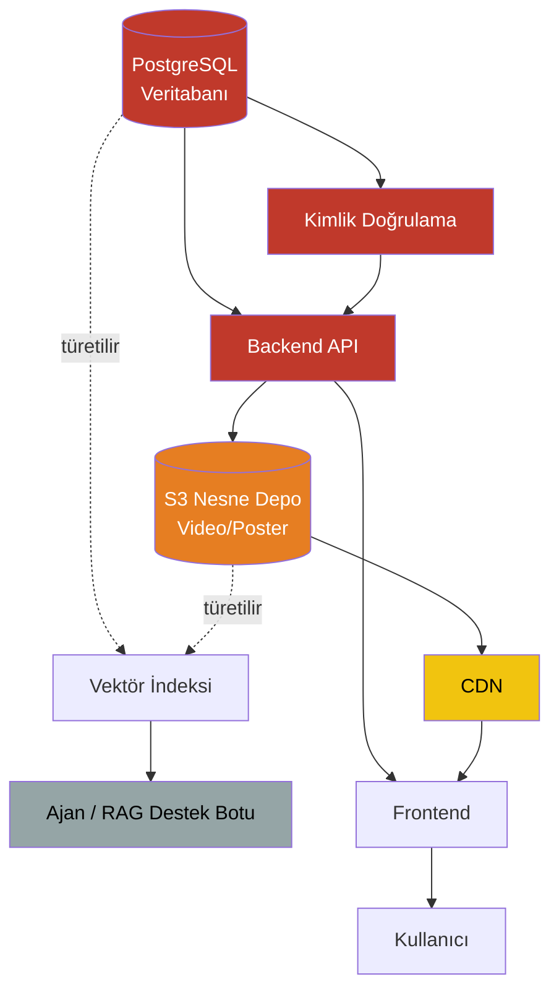

# Bağımlılık Diyagramı

## Doküman Bilgileri

| Alan | Değer |
|------|--------|
| Doküman Kodu | DOC-04 |
| Doküman Adı | Bağımlılık Diyagramı |
| Proje | Akademi Player Felaket Kurtarma Planı |
| Hazırlayan | Nehir Doğan |
| Görev | Database & Recovery Uzmanı |
| Sürüm | 1.0 |
| Tarih | 27.06.2026 |

---

# 1. Amaç

Bu doküman, Akademi Player platformundaki sistem bileşenleri arasındaki çalışma zamanı bağımlılıklarını görselleştirmekte ve felaket kurtarma sırasına (DOC-06) temel oluşturmaktadır.

---

# 2. Bileşen Akış Şeması



## 3. ASCII Gösterim (yedek)
```
[PostgreSQL] ---+--> [Kimlik Doğrulama] --+

|          |                        |

|          +------------------------>+--> [Backend API] ---> [S3 Nesne Depo] ---> [CDN] ---> [Frontend] ---> [Kullanıcı]

|                                                                  ^

+---------(türetilir)---------> [Vektör İndeksi] <----(türetilir)--+

|

v

[Ajan / RAG Destek Botu]
```

---

# 4. Bağımlılık Tablosu

| Bileşen | Bağlı Olduğu | Bağımlılık Türü | Kaynak |
|---|---|---|---|
| Kimlik Doğrulama | PostgreSQL | Zorunlu (hard) | DOC-02 §4 |
| Backend API | PostgreSQL, Kimlik Doğrulama, S3 | Zorunlu (hard) | DOC-02 §4 |
| CDN | S3 | Zorunlu (hard, kendi veri kaynağı yok) | DOC-02 §4 |
| Frontend | Backend API, CDN | Zorunlu (hard) | DOC-01 §2, DOC-02 §3 |
| Vektör İndeksi | PostgreSQL, S3 | Türetilen (rebuildable) | DOC-02 §5 |
| Ajan / RAG Bot | Vektör İndeksi | Zorunlu ama düşük öncelik | DOC-02 §5 |

---

# 5. Kritik Gözlem

PostgreSQL grafikte en az iki doğrudan bağımlı bileşene (Kimlik Doğrulama, Backend API) kaynak teşkil ediyor ve dolaylı olarak Vektör İndeksi üzerinden Ajan/RAG Bot'u da besliyor. Bu, DOC-02 ve DOC-03'teki "PostgreSQL = en kritik bileşen (5/5)" tespitini bağımlılık grafiği üzerinden doğrulamaktadır.

S3, tek doğrudan bağımlısı (CDN) ile PostgreSQL'den daha "yaprak" konumdadır — DOC-02 §4'teki "S3'ün geri yükleme duyarlılığı PostgreSQL'den düşük (3/5 vs 5/5)" değerlendirmesiyle örtüşmektedir.
